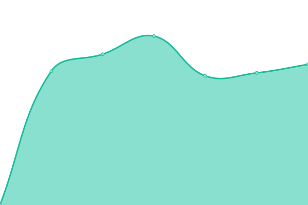

# [📈 Live Status](https://demo.upptime.js.org): <!--live status--> **🟧 Partial outage**

This repository contains the open-source uptime monitor and status page for [A7Designs](https://demo.upptime.js.org), powered by [Upptime](https://github.com/upptime/upptime).

With [Upptime](https://upptime.js.org), you can get your own unlimited and free uptime monitor and status page, powered entirely by a GitHub repository. We use [Issues](https://github.com/daverad525/upptime-monitor/issues) as incident reports, [Actions](https://github.com/daverad525/upptime-monitor/actions) as uptime monitors, and [Pages](https://demo.upptime.js.org) for the status page.

<!--start: status pages-->
<!-- This summary is generated by Upptime (https://github.com/upptime/upptime) -->
<!-- Do not edit this manually, your changes will be overwritten -->
<!-- prettier-ignore -->
| URL | Status | History | Response Time | Uptime |
| --- | ------ | ------- | ------------- | ------ |
|  [A7](https://a7.com.au) | 🟩 Up | [a7.yml](https://github.com/daverad525/upptime-monitor/commits/HEAD/history/a7.yml) | 

 3712ms
     
 | 

<a href="https://daverad525.github.io/upptime-monitor/history/a7">97.62%</a>
    

|  [adelaidewebsitedesign.com.au](https://adelaidewebsitedesign.com.au) | 🟩 Up | [adelaidewebsitedesign-com-au.yml](https://github.com/daverad525/upptime-monitor/commits/HEAD/history/adelaidewebsitedesign-com-au.yml) | 

 2562ms
     
 | 

<a href="https://daverad525.github.io/upptime-monitor/history/adelaidewebsitedesign-com-au">100.00%</a>
    

|  [a7 virtual reality tours](https://a7virtualrealitytours.com.au/) | 🟩 Up | [a7-virtual-reality-tours.yml](https://github.com/daverad525/upptime-monitor/commits/HEAD/history/a7-virtual-reality-tours.yml) | 

 4714ms
     
 | 

<a href="https://daverad525.github.io/upptime-monitor/history/a7-virtual-reality-tours">100.00%</a>
    

|  [abcfriendssa.net.au](https://abcfriendssa.net.au/) | 🟩 Up | [abcfriendssa-net-au.yml](https://github.com/daverad525/upptime-monitor/commits/HEAD/history/abcfriendssa-net-au.yml) | 

 2769ms
     
 | 

<a href="https://daverad525.github.io/upptime-monitor/history/abcfriendssa-net-au">100.00%</a>
    

|  [allclassequipmenttraining.com](https://allclassequipmenttraining.com/) | 🟩 Up | [allclassequipmenttraining-com.yml](https://github.com/daverad525/upptime-monitor/commits/HEAD/history/allclassequipmenttraining-com.yml) | 

 750ms
     
 | 

<a href="https://daverad525.github.io/upptime-monitor/history/allclassequipmenttraining-com">100.00%</a>
    

|  [advancesheetmetal.com.au](https://advancesheetmetal.com.au/) | 🟩 Up | [advancesheetmetal-com-au.yml](https://github.com/daverad525/upptime-monitor/commits/HEAD/history/advancesheetmetal-com-au.yml) | 

 1413ms
     
 | 

<a href="https://daverad525.github.io/upptime-monitor/history/advancesheetmetal-com-au">100.00%</a>
    

|  [barossafunerals.com.au](https://barossafunerals.com.au/) | 🟩 Up | [barossafunerals-com-au.yml](https://github.com/daverad525/upptime-monitor/commits/HEAD/history/barossafunerals-com-au.yml) | 

 1336ms
     
 | 

<a href="https://daverad525.github.io/upptime-monitor/history/barossafunerals-com-au">99.48%</a>
    

|  [beyond-kathleenstacey.com.au](https://beyond-kathleenstacey.com.au/) | 🟩 Up | [beyond-kathleenstacey-com-au.yml](https://github.com/daverad525/upptime-monitor/commits/HEAD/history/beyond-kathleenstacey-com-au.yml) | 

 3882ms
     
 | 

<a href="https://daverad525.github.io/upptime-monitor/history/beyond-kathleenstacey-com-au">100.00%</a>
    

|  [bikeboxes.com.au](https://bikeboxes.com.au/) | 🟩 Up | [bikeboxes-com-au.yml](https://github.com/daverad525/upptime-monitor/commits/HEAD/history/bikeboxes-com-au.yml) | 

 3463ms
     
 | 

<a href="https://daverad525.github.io/upptime-monitor/history/bikeboxes-com-au">100.00%</a>
    

|  [blackwoodbusinessdirectory.com.au](https://blackwoodbusinessdirectory.com.au/) | 🟩 Up | [blackwoodbusinessdirectory-com-au.yml](https://github.com/daverad525/upptime-monitor/commits/HEAD/history/blackwoodbusinessdirectory-com-au.yml) | 

 1456ms
     
 | 

<a href="https://daverad525.github.io/upptime-monitor/history/blackwoodbusinessdirectory-com-au">100.00%</a>
    

|  [blackwoodtreeservice.com.au](https://blackwoodtreeservice.com.au/) | 🟩 Up | [blackwoodtreeservice-com-au.yml](https://github.com/daverad525/upptime-monitor/commits/HEAD/history/blackwoodtreeservice-com-au.yml) | 

 2616ms
     
 | 

<a href="https://daverad525.github.io/upptime-monitor/history/blackwoodtreeservice-com-au">100.00%</a>
    

|  [blmcarchitectural.com.au](https://blmcarchitectural.com.au/) | 🟩 Up | [blmcarchitectural-com-au.yml](https://github.com/daverad525/upptime-monitor/commits/HEAD/history/blmcarchitectural-com-au.yml) | 

 2582ms
     
 | 

<a href="https://daverad525.github.io/upptime-monitor/history/blmcarchitectural-com-au">100.00%</a>
    

|  [craigburnwines.com.au](https://craigburnwines.com.au/) | 🟩 Up | [craigburnwines-com-au.yml](https://github.com/daverad525/upptime-monitor/commits/HEAD/history/craigburnwines-com-au.yml) | 

 1768ms
     
 | 

<a href="https://daverad525.github.io/upptime-monitor/history/craigburnwines-com-au">100.00%</a>
    

|  [cunninghamandharvey.com.au](https://cunninghamandharvey.com.au/) | 🟩 Up | [cunninghamandharvey-com-au.yml](https://github.com/daverad525/upptime-monitor/commits/HEAD/history/cunninghamandharvey-com-au.yml) | 

 3063ms
     
 | 

<a href="https://daverad525.github.io/upptime-monitor/history/cunninghamandharvey-com-au">100.00%</a>
    

|  [emailletterhead.com](https://emailletterhead.com/) | 🟩 Up | [emailletterhead-com.yml](https://github.com/daverad525/upptime-monitor/commits/HEAD/history/emailletterhead-com.yml) | 

 739ms
     
 | 

<a href="https://daverad525.github.io/upptime-monitor/history/emailletterhead-com">100.00%</a>
    

|  [executiveflowers.com.au](https://executiveflowers.com.au/) | 🟩 Up | [executiveflowers-com-au.yml](https://github.com/daverad525/upptime-monitor/commits/HEAD/history/executiveflowers-com-au.yml) | 

 235ms
     
 | 

<a href="https://daverad525.github.io/upptime-monitor/history/executiveflowers-com-au">100.00%</a>
    

|  [families4families.org.au](https://families4families.org.au/) | 🟩 Up | [families4families-org-au.yml](https://github.com/daverad525/upptime-monitor/commits/HEAD/history/families4families-org-au.yml) | 

 1254ms
     
 | 

<a href="https://daverad525.github.io/upptime-monitor/history/families4families-org-au">100.00%</a>
    

|  [floorsafe.com.au](https://floorsafe.com.au) | 🟩 Up | [floorsafe-com-au.yml](https://github.com/daverad525/upptime-monitor/commits/HEAD/history/floorsafe-com-au.yml) | 

 1671ms
     
 | 

<a href="https://daverad525.github.io/upptime-monitor/history/floorsafe-com-au">100.00%</a>
    

|  [glaciemcooling.com](https://glaciemcooling.com) | 🟥 Down | [glaciemcooling-com.yml](https://github.com/daverad525/upptime-monitor/commits/HEAD/history/glaciemcooling-com.yml) | 

 5307ms
     
 | 

<a href="https://daverad525.github.io/upptime-monitor/history/glaciemcooling-com">97.90%</a>
    

|  [hancockandjust.com.au](https://hancockandjust.com.au/) | 🟩 Up | [hancockandjust-com-au.yml](https://github.com/daverad525/upptime-monitor/commits/HEAD/history/hancockandjust-com-au.yml) | 

 2171ms
     
 | 

<a href="https://daverad525.github.io/upptime-monitor/history/hancockandjust-com-au">100.00%</a>
    

|  [equiheal.com.au](https://equiheal.com.au/) | 🟩 Up | [equiheal-com-au.yml](https://github.com/daverad525/upptime-monitor/commits/HEAD/history/equiheal-com-au.yml) | 

 824ms
     
 | 

<a href="https://daverad525.github.io/upptime-monitor/history/equiheal-com-au">100.00%</a>
    

|  [hrmmatters.com.au](https://hrmmatters.com.au/) | 🟩 Up | [hrmmatters-com-au.yml](https://github.com/daverad525/upptime-monitor/commits/HEAD/history/hrmmatters-com-au.yml) | 

 2367ms
     
 | 

<a href="https://daverad525.github.io/upptime-monitor/history/hrmmatters-com-au">100.00%</a>
    

|  [lisadallarosa.com.au](https://lisadallarosa.com.au/) | 🟩 Up | [lisadallarosa-com-au.yml](https://github.com/daverad525/upptime-monitor/commits/HEAD/history/lisadallarosa-com-au.yml) | 

 907ms
     
 | 

<a href="https://daverad525.github.io/upptime-monitor/history/lisadallarosa-com-au">100.00%</a>
    

|  [mondaymorningmile.com](https://mondaymorningmile.com/) | 🟩 Up | [mondaymorningmile-com.yml](https://github.com/daverad525/upptime-monitor/commits/HEAD/history/mondaymorningmile-com.yml) | 

 1804ms
     
 | 

<a href="https://daverad525.github.io/upptime-monitor/history/mondaymorningmile-com">100.00%</a>
    

|  [myoenergy.com.au](https://myoenergy.com.au/) | 🟩 Up | [myoenergy-com-au.yml](https://github.com/daverad525/upptime-monitor/commits/HEAD/history/myoenergy-com-au.yml) | 

 2348ms
     
 | 

<a href="https://daverad525.github.io/upptime-monitor/history/myoenergy-com-au">100.00%</a>
    

|  [neatspirits.com.au](https://neatspirits.com.au/) | 🟩 Up | [neatspirits-com-au.yml](https://github.com/daverad525/upptime-monitor/commits/HEAD/history/neatspirits-com-au.yml) | 

 2558ms
     
 | 

<a href="https://daverad525.github.io/upptime-monitor/history/neatspirits-com-au">100.00%</a>
    

|  [noarlungacc.org.au](https://noarlungacc.org.au/) | 🟩 Up | [noarlungacc-org-au.yml](https://github.com/daverad525/upptime-monitor/commits/HEAD/history/noarlungacc-org-au.yml) | 

 2836ms
     
 | 

<a href="https://daverad525.github.io/upptime-monitor/history/noarlungacc-org-au">100.00%</a>
    

|  [permusoft.com.au](https://permusoft.com.au/) | 🟩 Up | [permusoft-com-au.yml](https://github.com/daverad525/upptime-monitor/commits/HEAD/history/permusoft-com-au.yml) | 

 895ms
     
 | 

<a href="https://daverad525.github.io/upptime-monitor/history/permusoft-com-au">100.00%</a>
    

|  [plantscape.com.au](https://plantscape.com.au/) | 🟩 Up | [plantscape-com-au.yml](https://github.com/daverad525/upptime-monitor/commits/HEAD/history/plantscape-com-au.yml) | 

 2876ms
     
 | 

<a href="https://daverad525.github.io/upptime-monitor/history/plantscape-com-au">100.00%</a>
    

|  [redgumandmore.com.au](https://redgumandmore.com.au/) | 🟩 Up | [redgumandmore-com-au.yml](https://github.com/daverad525/upptime-monitor/commits/HEAD/history/redgumandmore-com-au.yml) | 

 1356ms
     
 | 

<a href="https://daverad525.github.io/upptime-monitor/history/redgumandmore-com-au">100.00%</a>
    

|  [roofingcentral.com.au](https://roofingcentral.com.au/) | 🟩 Up | [roofingcentral-com-au.yml](https://github.com/daverad525/upptime-monitor/commits/HEAD/history/roofingcentral-com-au.yml) | 

 3195ms
     
 | 

<a href="https://daverad525.github.io/upptime-monitor/history/roofingcentral-com-au">100.00%</a>
    

|  [securestart.com.au](https://securestart.com.au/) | 🟩 Up | [securestart-com-au.yml](https://github.com/daverad525/upptime-monitor/commits/HEAD/history/securestart-com-au.yml) | 

 3419ms
     
 | 

<a href="https://daverad525.github.io/upptime-monitor/history/securestart-com-au">100.00%</a>
    

|  [sturtstumpcutters.com.au](https://sturtstumpcutters.com.au/) | 🟥 Down | [sturtstumpcutters-com-au.yml](https://github.com/daverad525/upptime-monitor/commits/HEAD/history/sturtstumpcutters-com-au.yml) | 

 2339ms
     
 | 

<a href="https://daverad525.github.io/upptime-monitor/history/sturtstumpcutters-com-au">89.42%</a>
    

|  [thechiropracticdomain.com.au](https://thechiropracticdomain.com.au/) | 🟩 Up | [thechiropracticdomain-com-au.yml](https://github.com/daverad525/upptime-monitor/commits/HEAD/history/thechiropracticdomain-com-au.yml) | 

 469ms
     
 | 

<a href="https://daverad525.github.io/upptime-monitor/history/thechiropracticdomain-com-au">100.00%</a>
    

|  [thehillsarborists.com.au](https://thehillsarborists.com.au/) | 🟩 Up | [thehillsarborists-com-au.yml](https://github.com/daverad525/upptime-monitor/commits/HEAD/history/thehillsarborists-com-au.yml) | 

 2642ms
     
 | 

<a href="https://daverad525.github.io/upptime-monitor/history/thehillsarborists-com-au">100.00%</a>
    

|  [generaltools.com.au](https://generaltools.com.au/) | 🟩 Up | [generaltools-com-au.yml](https://github.com/daverad525/upptime-monitor/commits/HEAD/history/generaltools-com-au.yml) | 

 2296ms
     
 | 

<a href="https://daverad525.github.io/upptime-monitor/history/generaltools-com-au">99.77%</a>
    

|  [bakeandbrew.com.au](https://bakeandbrew.com.au) | 🟩 Up | [bakeandbrew-com-au.yml](https://github.com/daverad525/upptime-monitor/commits/HEAD/history/bakeandbrew-com-au.yml) | 

 4445ms
     
 | 

<a href="https://daverad525.github.io/upptime-monitor/history/bakeandbrew-com-au">100.00%</a>
    

|  [voiceoversonthenet.net](https://voiceoversonthenet.net) | 🟩 Up | [voiceoversonthenet-net.yml](https://github.com/daverad525/upptime-monitor/commits/HEAD/history/voiceoversonthenet-net.yml) | 

 1218ms
     
 | 

<a href="https://daverad525.github.io/upptime-monitor/history/voiceoversonthenet-net">98.72%</a>
    

|  [Google AU](https://www.google.com.au) | 🟩 Up | [google-au.yml](https://github.com/daverad525/upptime-monitor/commits/HEAD/history/google-au.yml) | 

 199ms
     
 | 

<a href="https://daverad525.github.io/upptime-monitor/history/google-au">100.00%</a>
    

|  [Wikipedia](https://en.wikipedia.org) | 🟩 Up | [wikipedia.yml](https://github.com/daverad525/upptime-monitor/commits/HEAD/history/wikipedia.yml) | 

 86ms
     
 | 

<a href="https://daverad525.github.io/upptime-monitor/history/wikipedia">100.00%</a>
    

|  [Test Broken Site](https://thissitedoesnotexist.koj.co) | 🟥 Down | [test-broken-site.yml](https://github.com/daverad525/upptime-monitor/commits/HEAD/history/test-broken-site.yml) | 

 0ms
     
 | 

<a href="https://daverad525.github.io/upptime-monitor/history/test-broken-site">100.00%</a>
    

|  [IPv6 test](forwardemail.net) | 🟥 Down | [i-pv6-test.yml](https://github.com/daverad525/upptime-monitor/commits/HEAD/history/i-pv6-test.yml) | 

 0ms
     
 | 

<a href="https://daverad525.github.io/upptime-monitor/history/i-pv6-test">100.00%</a>
    

<!--end: status pages-->

[**Visit our status website →**](https://demo.upptime.js.org)

## 📄 License

- Powered by: [Upptime](https://github.com/upptime/upptime)
- Code: [MIT](./LICENSE) © [Anand Chowdhary](https://anandchowdhary.com), supported by [Pabio](https://pabio.com)
- Data in the `./history` directory: [Open Database License](https://opendatacommons.org/licenses/odbl/1-0/)
